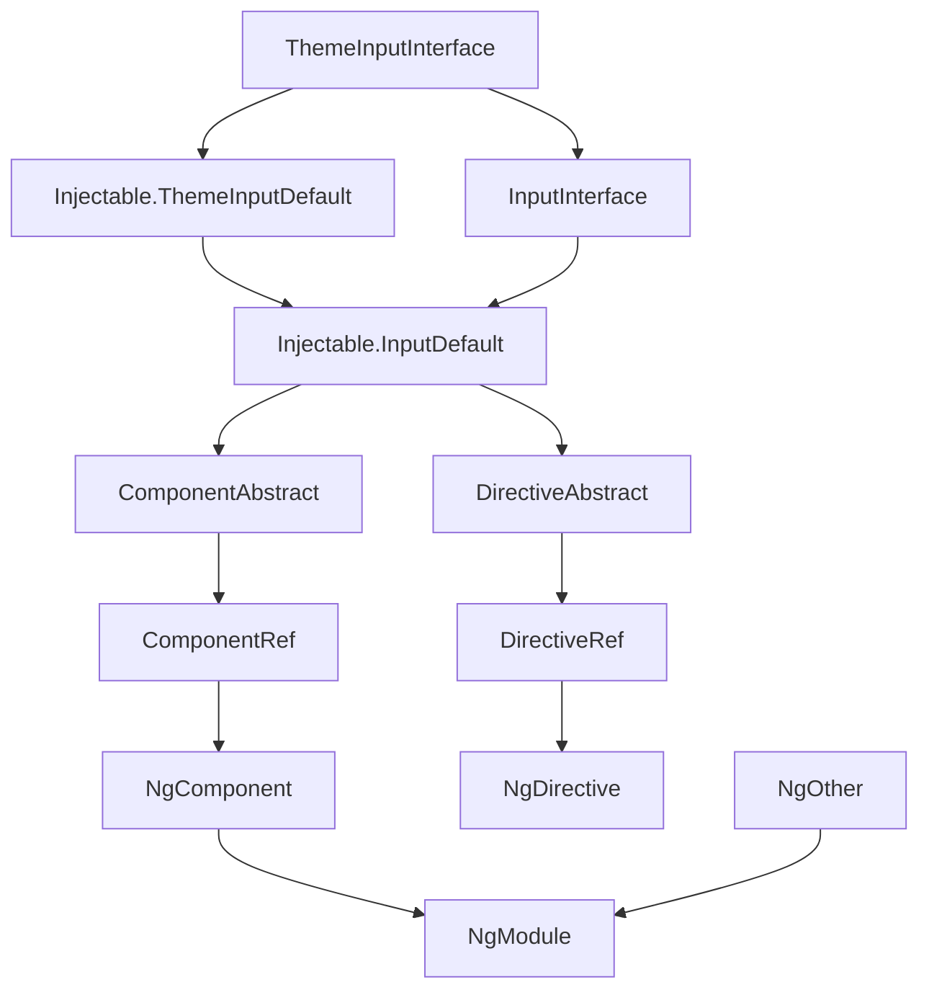

### 开发 angular 的正确姿势

变量
builder 创建者 
factory 工厂
dispatcher 调度员
render 渲染
ruler 规则
config 配置
error 错误
outlet 出口
container 容器
ref 参考函数
helper 帮助
defualt 默认
category 类型
kernel 核心
native 原生
theme 主题
launcher 发射器
indicator 指示器
wrapper 封装
widget 装饰
engine 引擎
summary 摘要
reit 比率
point 点
answer 答案
primitiv 初始的
log 日志
initial 最初的
manage 控制
access 访问
adapter 适配器
alias 别名
operator 操作符
atom 原子
case 情形
created 创建
attached 附加
detached 剥离

# iwe7已有库功能汇总
| 插件          | 说明                  | 地址            |
|-------------|---------------------|---------------|
| `iwe7-base` | 基础类库                | [iwe7-base]() |
| `iwe7-icss` | `rxjs` 控制 `css` 工具 | [iwe7-icss]() |

## 单功能组件
| 组件|说明|使用|地址|

## 组合功能组件

## 业务组件
