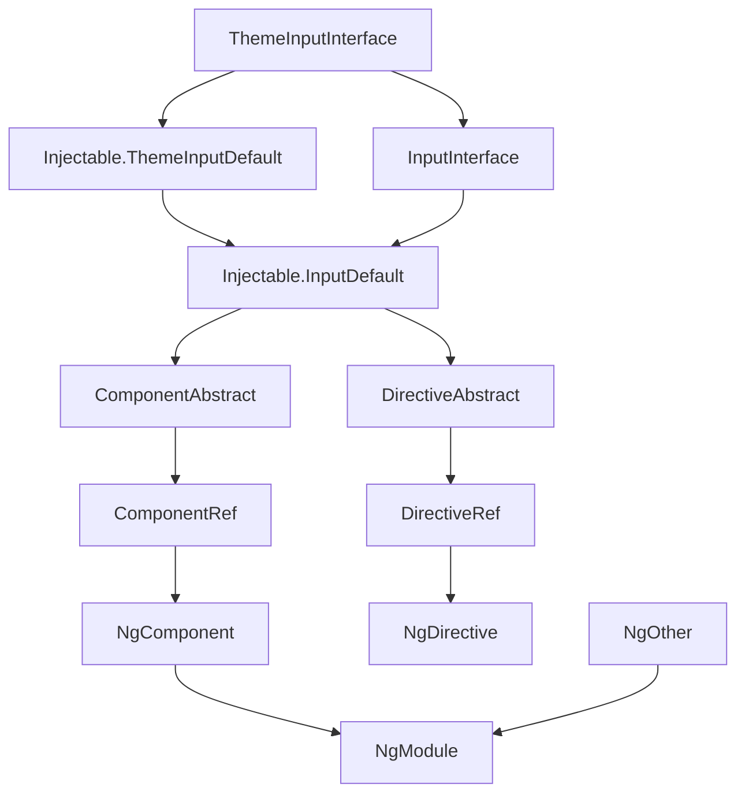

### 开发 angular 的正确姿势

```mermaid
graph TD;
  ThemeInputInterface-->InputInterface;
  ThemeInputInterface-->Injectable.ThemeInputDefault;
  Injectable.ThemeInputDefault-->Injectable.InputDefault;
  InputInterface-->Injectable.InputDefault;
  Injectable.InputDefault-->ComponentAbstract;
  Injectable.InputDefault-->DirectiveAbstract;
  ComponentAbstract-->ComponentRef;
  ComponentRef-->NgComponent;
  DirectiveAbstract-->DirectiveRef;
  DirectiveRef-->NgDirective;
  NgComponent-->NgModule;
  NgOther-->NgModule;
```
