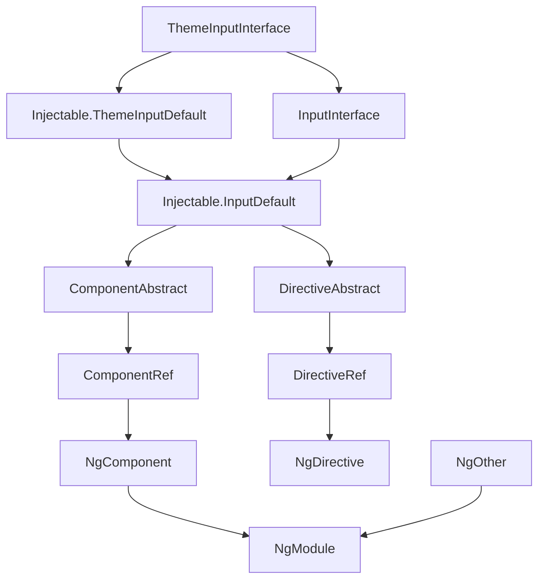

### 开发 angular 的正确姿势

# iwe7已有库功能汇总
| 插件        | 说明             | 地址            |
|-----------|----------------|---------------|
| iwe7-base | 基础类库           | [iwe7-base]() |
| iwe7-icss | rxjs 控制 css工具 | [iwe7-icss]() |
