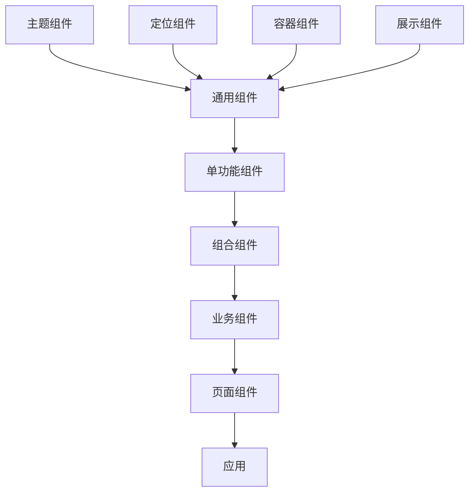

## 组件库

#### `general.component` 通用组件

| 类型                  | 名称   | 说明      |
|---------------------|------|---------|
| layout.compnoent    | 定位组件 | 负责定位    |
| container.component | 容器组件 | 负责数据分发  |
| view.component      | 展示组件 | 负责数据展示  |
| theme.component     | 主题组件 | 负责多主题支持 |

#### `single.component` 单功能组件

> 基础组件

| 名称               | 标题     | 说明                   | 状态(❌未完成,✔已完成) |
|------------------|--------|----------------------|---------------|
| iwe7-square      | 正方形组件  | 提供正方形展示              | [❌]           |
| iwe7-button      | 按钮组件   | 提供了各种类型、样子、状态以及图标    | [❌]           |
| iwe7-loading     | 加载     | 提供了可自定义大小的加载动画       | [❌]           |
| iwe7-tip         | 提示     | 用于弹出提示气泡框            | [❌]           |
| iwe7-tool-bar    | 工具栏    | 可以组合多个按钮，复选框操作为一个工具栏 | [❌]           |
| iwe7-layout      | Flex组件 | CSS flex 布局的一个封装     | [❌]           |
| iwe7-wing-blank  | 布局控件   | 两翼留白                 | [❌]           |
| iwe7-white-space | 布局控件   | 上下留白                 | [❌]           |

> 表单组件

| 名称                    | 标题        | 说明                          | 状态(❌未完成,✔已完成) |
|-----------------------|-----------|-----------------------------|---------------|
| iwe7-checkbox         | 复选框       | 可设置其状态、传入特殊 class 以及复选框图标位置 | [❌]           |
| iwe7-checkbox-group   | 复选框组      | 主要用来选择一组可选项                 | [❌]           |
| iwe7-radio            | 单选框组      | 可设置单选框组内容，样式等               | [❌]           |
| iwe7-input            | 输入框组件     | 输入内容                        | [❌]           |
| iwe7-textarea         | 多行输入框组件   | 输入内容                        | [❌]           |
| iwe7-select           | Select 组件 | 用于选项选择                      | [❌]           |
| iwe7-switch           | 滑动开关      | 用于切换 on/off 状态              | [❌]           |
| iwe7-rate             | 评分组件      | 以用作评价评星                     | [❌]           |
| iwe7-range            | 评分组件      | 以用作评价评星                     | [❌]           |
| iwe7-search-bar       | 评分组件      | 以用作评价评星                     | [❌]           |
| iwe7-uploader         | 上传组件      | 用于附件上传                      | [❌]           |
| iwe7-slider           | 滑动输入条     | 用于附件上传                      | [❌]           |
| iwe7-stepper          | 步进器       | 用于附件上传                      | [❌]           |
| iwe7-picker           | 选择组件      | 用于选择数据                      | [❌]           |
| iwe7-picker-view      | 选择组件      | 用于选择数据                      | [❌]           |
| iwe7-cascade-picker   | 级联选择组件    | 用于关联数据选择                    | [❌]           |
| iwe7-date-picker      | 日期选择      | 用于日期选择                      | [❌]           |
| iwe7-date-picker-view | 日期选择器     | 用于日期选择                      | [❌]           |
| iwe7-time-picer       | 时间选择组件    | 用于选择时间                      | [❌]           |
| iwe7-segment-picer    | 分段选择组件    | 用于分段选择                      | [❌]           |
| iwe7-location-picer   | 经纬度选择组件   | 用于选取所在经纬度信息                 | [❌]           |
| iwe7-city-picker      | 城市选择组件    | 用于选择所在城市                    | [❌]           |
| iwe7-city-picker      | 城市选择组件    | 用于选择所在城市                    | [❌]           |
| iwe7-calendar         | 日历        | 用于选择日期区间                    | [❌]           |
| iwe7-image-picker     | 图片选择器     | 用于选择日期区间                    | [❌]           |
| iwe7-icon-picker      | 图标选择器     | 用于选择日期区间                    | [❌]           |
| iwe7-emoji-picker     | 表情选择器     | 用于选择日期区间                    | [❌]           |

> 弹出层

| 名称                 | 标题     | 说明                                                       | 状态(❌未完成,✔已完成) |
|--------------------|--------|----------------------------------------------------------|---------------|
| iwe7-toast         | 提醒组件   | 非模态信息提醒                                                  | [❌]           |
| iwe7-popup         | 弹层组件   | 主要用于基于此组件实现上层组件封装，只提供了基础功能：指定类型、是否有背景层、显示内容（HTML）以及是否居中。 | [❌]           |
| iwe7-dialog        | 模态框组件  | 提供了多种样式及交互形式。                                            | [❌]           |
| iwe7-action-sheet  | 操作列表组件 | 操作列表组件                                                   | [❌]           |
| iwe7-drawer        | 抽屉组件   | 主要用来需要大范围层级进行选择的场景，一般情况下应该是满屏状态。                         | [❌]           |
| iwe7-popover       | 抽屉组件   | 主要用来需要大范围层级进行选择的场景，一般情况下应该是满屏状态。                         | [❌]           |
| iwe7-schma-control | 抽屉组件   | 主要用来需要大范围层级进行选择的场景，一般情况下应该是满屏状态。                         | [❌]           |
| iwe7-tabs          | 抽屉组件   | 主要用来需要大范围层级进行选择的场景，一般情况下应该是满屏状态。                         | [❌]           |
| iwe7-tab-bar       | 抽屉组件   | 主要用来需要大范围层级进行选择的场景，一般情况下应该是满屏状态。                         | [❌]           |
| iwe7-pagination    | 抽屉组件   | 主要用来需要大范围层级进行选择的场景，一般情况下应该是满屏状态。                         | [❌]           |
| iwe7-nav-bar       | 抽屉组件   | 主要用来需要大范围层级进行选择的场景，一般情况下应该是满屏状态。                         | [❌]           |
| iwe7-menu          | 抽屉组件   | 主要用来需要大范围层级进行选择的场景，一般情况下应该是满屏状态。                         | [❌]           |

> 滚动

| 名称                      | 标题   | 说明                | 状态(❌未完成,✔已完成) |
|-------------------------|------|-------------------|---------------|
| iwe7-scroll             | 滚动列表 | 提供了优质的原生滚动体验      | [❌]           |
| iwe7-index-list         | 索引列表 | 提供了列表索引的功能        | [❌]           |
| iwe7-slide              | 轮播图  | 提供了常见的轮播及swipe的功能 | [❌]           |
| iwe7-swipe              | 滑块组件 | 提供类似微信列表左滑功能      | [❌]           |
| iwe7-progress           | 滑块组件 | 提供类似微信列表左滑功能      | [❌]           |
| iwe7-activity-indicator | 滑块组件 | 提供类似微信列表左滑功能      | [❌]           |
| iwe7-pull-to-refresh    | 滑块组件 | 提供类似微信列表左滑功能      | [❌]           |

> 其他

| 名称              | 标题   | 说明           | 状态(❌未完成,✔已完成) |
|-----------------|------|--------------|---------------|
| iwe7-accordion  | 滚动列表 | 提供了优质的原生滚动体验 | [❌]           |
| iwe7-badge      | 滚动列表 | 提供了优质的原生滚动体验 | [❌]           |
| iwe7-card       | 滚动列表 | 提供了优质的原生滚动体验 | [❌]           |
| iwe7-grid       | 滚动列表 | 提供了优质的原生滚动体验 | [❌]           |
| iwe7-icon       | 滚动列表 | 提供了优质的原生滚动体验 | [❌]           |
| iwe7-list       | 滚动列表 | 提供了优质的原生滚动体验 | [❌]           |
| iwe7-notice-bar | 滚动列表 | 提供了优质的原生滚动体验 | [❌]           |
| iwe7-steps      | 滚动列表 | 提供了优质的原生滚动体验 | [❌]           |
| iwe7-tag        | 滚动列表 | 提供了优质的原生滚动体验 | [❌]           |
| iwe7-list-view  | 滚动列表 | 提供了优质的原生滚动体验 | [❌]           |
| iwe7-result     | 滚动列表 | 提供了优质的原生滚动体验 | [❌]           |
| iwe7-video-view | 视频播放 | 提供了优质的原生滚动体验 | [❌]           |
| iwe7-voice-view | 音频播放 | 提供了优质的原生滚动体验 | [❌]           |

- `combin.component` 组合组件

| 名称                | 标题   | 说明           | 状态(❌未完成,✔已完成) |
|-------------------|------|--------------|---------------|
| iwe7-success      | 成功提示 | 提供了优质的原生滚动体验 | [❌]           |
| iwe7-fail         | 失败提示 | 提供了优质的原生滚动体验 | [❌]           |
| iwe7-payment      | 支付组件 | 提供了优质的原生滚动体验 | [❌]           |
| iwe7-dynamic-form | 动态组件 | 提供了优质的原生滚动体验 | [❌]           |
| iwe7-goods-search | 商品搜索 | 提供了优质的原生滚动体验 | [❌]           |
| iwe7-goods-detail | 商品详情 | 提供了优质的原生滚动体验 | [❌]           |

- `business.component` 业务组件
| 名称            | 标题   | 说明    | 状态(❌未完成,✔已完成) |
|---------------|------|-------|---------------|
| iwe7-jd-index | 京东首页 | 仿京东首页 | [❌]           |

- `page.component` 页面组件
> 页面对将业务组件接后台数据

